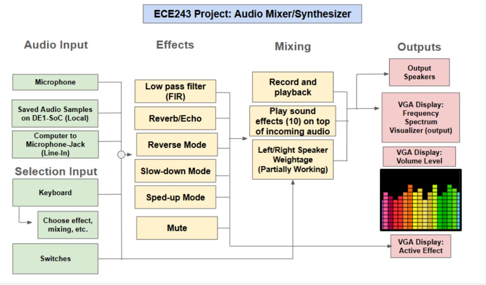

# Audio Mixer – DE1-SoC FPGA Project

## Overview
This project implements a real-time **audio mixer** on the DE1-SoC FPGA board.  
It processes live audio input from a microphone or computer line-out and allows for various effects such as:  

- Recording and playback (forward, reverse, slow, fast)  
- Echo with configurable delay and damping  
- Low-pass filtering using a FIR filter  
- Additional sound effects (e.g., air horn samples)  
- Real-time frequency spectrum visualization using [KissFFT](https://github.com/mborgerding/kissfft)  
- Volume/mode indicators on VGA display  

The program provides both **audio output to speakers** and **visual feedback** on VGA, making it an interactive audio DSP system.

---

## Features
- **Keyboard Controls (PS/2)**: Toggle modes such as recording, playback direction, echo, and filters via hotkeys.  
- **Switch Controls**: Adjust filter cutoff strength, echo damping, and delay values via DE1-SoC switches.  
- **Interrupt-Driven Design**: Efficient handling of audio I/O using audio and keyboard interrupts.  
- **FFT-based Visualization**: Real-time spectral analysis with KissFFT (O(N log N)), displayed on VGA as frequency bins (125 Hz resolution at 8 kHz sampling).  
- **Pre-recorded Effects**: Playback of sampled sounds stored in arrays.  
- **Custom Circuit**: A downconversion circuit was designed to safely route line-out audio into the DE1-SoC’s mic-in port. This circuit reduces the incoming voltage to avoid distortion or damage to the board and provides the added benefit of **noise reduction**, ensuring cleaner audio input.  

---

## Block Diagram

  

---

## Repository Structure
- **`main_mixer.c`** – Main source code containing audio interrupt handlers, effects, VGA drawing routines, and keyboard controls.  
- **`ECE243 Final Project Report.pdf`** – Detailed project documentation (design, implementation, testing, and results).  

---

## Demo
A short demo video is included in this repo:  

➡️ [Watch the Demo](https://www.youtube.com/watch?v=w973th-ANfM&ab_channel=KabirGuron)  

---

## Technical Details
- **Audio Processing**: Implemented via audio interrupts, buffering input samples, and applying DSP effects before writing to output FIFO.  
- **Low-Pass Filter**: First-order FIR filter where cutoff frequency is controlled by switch values.  
- **Echo Effect**: Circular buffer implementation with adjustable delay and damping factor.  
- **Recording**: Stores ~32,000 samples (~4 sec at 8kHz) in a buffer, playable forward or backward.  
- **KissFFT Integration**: Converts 64 most recent samples into frequency bins for VGA spectrum display.  
- **Line-Out to Mic-In Circuit**: A simple breadboard circuit attenuates the line-out signal to mic-in levels, preventing clipping and distortion while simultaneously filtering out unwanted noise.  

  

<em>Figure: Custom breadboard circuit used for line-out to mic-in voltage downconversion and noise reduction.</em>

---

## Acknowledgements
This project was worked on for ECE243 (Computer Organization), a University of Toronto course.

## Contributers
- [Kabir Guron](https://github.com/KabrG)  
- [Ved Patel](https://github.com/VedPatel10)  
